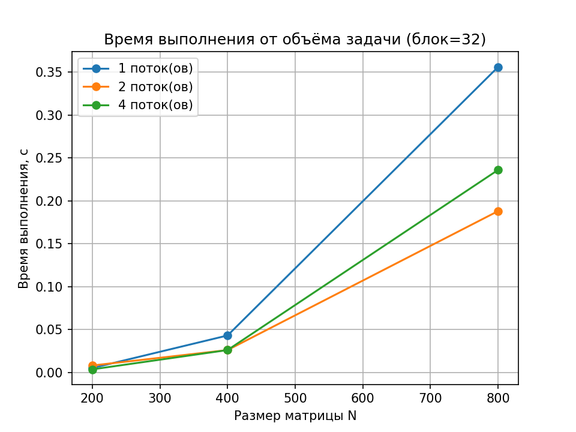
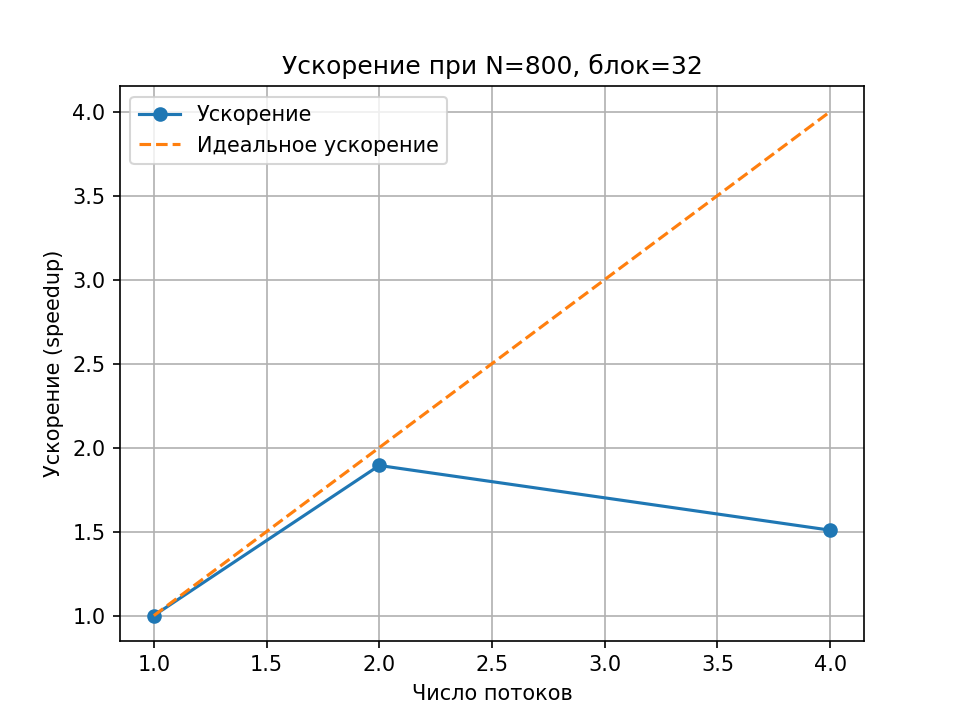
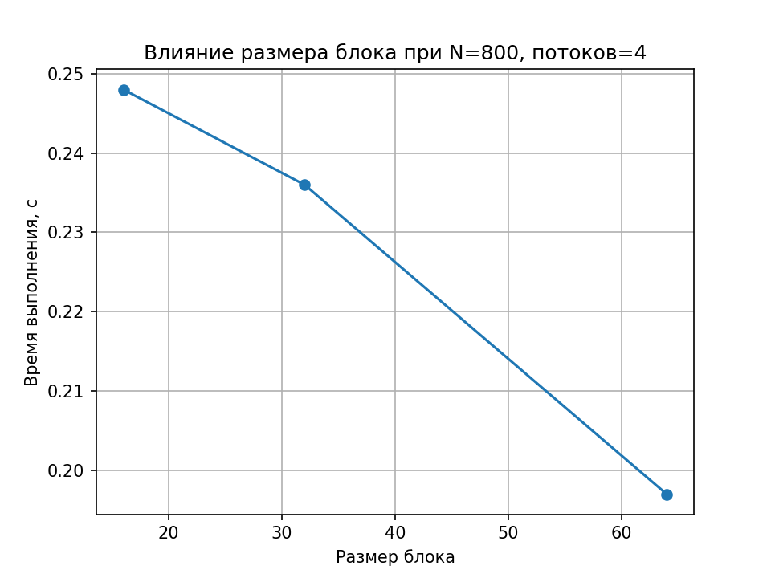

# Лабораторная работа: блочное (tiled) умножение матриц (OpenMP)

## Задание

Написать на C/C++ программу для перемножения двух квадратных матриц.
Вход — файлы с матрицами, выход — файл результата + метрики (время,
объём задачи, GFLOPS). Обязательна автоматизированная верификация с
помощью NumPy. Исследовать зависимость времени от размера задачи и от
параметров распараллеливания (число потоков, размер блока).

## Структура репозитория

| Файл               | Назначение                                              |
| ------------------ | -------------------------------------------------------- |
| `main.cpp`         | Блочное умножение матриц с OpenMP, замер времени          |
| `generate.py`      | Генерация случайных матриц                                |
| `verify.py`        | Сверка результата с NumPy                                 |
| `run.sh`           | Прогон по нескольким N, числам потоков и размерам блока    |
| `plot.py`          | Построение графиков по results.csv                        |
| `results.csv`      | Все замеры (генерируется после run.sh)                     |
| `graph_*.png`      | Графики (генерируются после plot.py)                       |

## Алгоритм и распараллеливание

Обычное умножение матриц тремя вложенными циклами плохо использует кэш
процессора на больших N: данные не помещаются в кэш целиком, и
процессор постоянно обращается к медленной оперативной памяти.

**Блочное (tiled) умножение** решает эту проблему: матрицы делятся на
квадратные блоки размера `blockSize x blockSize`, которые помещаются в
кэш. Результирующий блок `C[bi][bj]` вычисляется как сумма произведений
соответствующих блоков `A[bi][bk] * B[bk][bj]` по всем `bk`:

```
for bi in блоки строк:
    for bj in блоки столбцов:
        for bk in блоки суммирования:
            перемножить блок A[bi][bk] на блок B[bk][bj]
            и прибавить к блоку C[bi][bj]
```

Распараллеливание — по **парам блоков (bi, bj)**, а не по строкам
целиком:

```cpp
#pragma omp parallel for collapse(2) schedule(dynamic)
for (int bi = 0; bi < numBlocks; bi++) {
    for (int bj = 0; bj < numBlocks; bj++) {
        // блок C[bi][bj] считается независимо от других блоков
        ...
    }
}
```

`collapse(2)` объединяет два внешних цикла в один общий пул задач для
потоков — это даёт более мелкую и равномерную нарезку работы, чем
распараллеливание только по `bi`, особенно когда число блоков по
строкам меньше, чем число потоков.

## Как запустить

```bash
# один запуск
python3 generate.py 400
g++ -O2 -fopenmp main.cpp -o matrix_mult
./matrix_mult 4 32      # 4 потока, размер блока 32

# полное исследование
chmod +x run.sh
./run.sh
python3 plot.py
```

## Что исследуется

1. **Зависимость от объёма задачи** — время выполнения при N = 200, 400, 800
   (при фиксированном блоке 32 и разном числе потоков).
2. **Зависимость от числа потоков** — ускорение относительно 1 потока
   при фиксированном N и блоке 32.
3. **Зависимость от размера блока** — как меняется время при
   blockSize = 16, 32, 64 (при фиксированных N и числе потоков) —
   это дополнительный параметр, которого нет в построчном варианте
   распараллеливания.

## Результаты экспериментов 

### Время выполнения при блоке = 32 (секунды)

| N   | 1 поток | 2 потока | 4 потока |
| --- | ------- | -------- | -------- |
| 200 | 0.005   | 0.008    | 0.003    |
| 400 | 0.043   | 0.026    | 0.028    |
| 800 | 0.356   | 0.188    | 0.208    |

### Ускорение (Speedup = T1/Tp) и эффективность

| N   | S2    | E2  | S4    | E4  |
| --- | ----- | --- | ----- | --- |
| 200 | 0.63x | 31% | 1.67x | 42% |
| 400 | 1.65x | 83% | 1.54x | 38% |
| 800 | 1.89x | 95% | 1.71x | 43% |

### Влияние размера блока (4 потока, секунды)

| N   | блок=16 | блок=32 | блок=64 |
| --- | ------- | ------- | ------- |
| 200 | 0.006   | 0.0035  | 0.004   |
| 400 | 0.035   | 0.026   | 0.024   |
| 800 | 0.248   | 0.236   | 0.197   |

## Графики





## Выводы

1. При N=200 результаты нестабильны (на 2 потоках время даже выросло
относительно 1 потока) — задача слишком мелкая (миллисекунды), и
накладные расходы на создание потоков перевешивают выгоду от
распараллеливания, а сами замеры на таком масштабе сильно "шумят".

2. С ростом N ускорение становится осмысленным: при N=800 на 2
потоках ускорение почти 1.9x (95% эффективности, близко к идеалу).
На 4 потоках эффективность падает до 43% — вероятно, из-за
schedule(dynamic) и накладных расходов на распределение блоков между
потоками, а также из-за ограниченной пропускной способности памяти.

3. Размер блока заметнее влияет на больших N: при N=800 блок 64
оказался быстрее блока 16 (0.197 против 0.248 с) — крупный блок лучше
использует кэш и требует меньше итераций внешних циклов. На малых N
(200, 400) разница почти не видна — задача и так помещается в кэш
целиком независимо от размера блока.

4. Верификация через NumPy пройдена во всех запусках — максимальная
ошибка порядка 1e-10, что соответствует пределу точности типа double,
а не ошибке алгоритма.


## Автор

Бабаева Айпери 6213 https://github.com/babaevaaiperi/parallel_programming1
